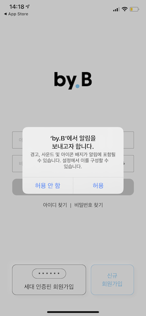
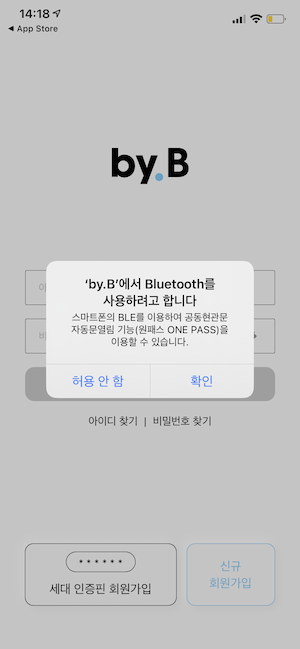
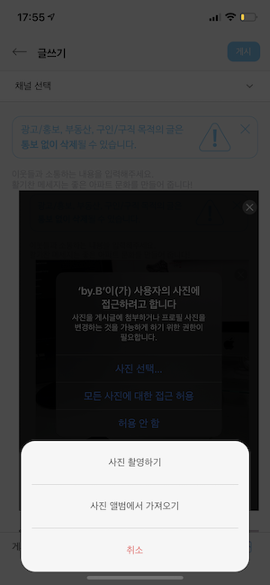
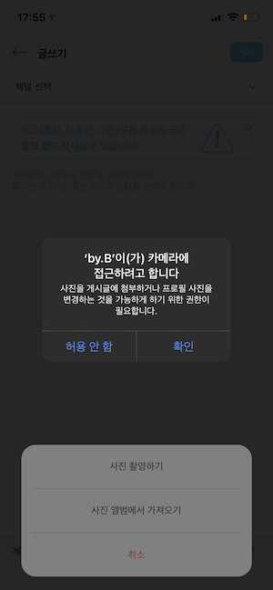
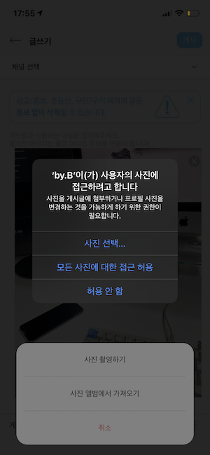

# 앱 사용 권한에 대해

### - OS에 따른 필요 앱 사용 권한
---
#### 목차
1. iOS
2. 안드로이드
3. by.B
    1) iOS
    2) 안드로이드
---

## 말머리

  전체를 요약하자면 휴대폰에서 제공하는 기본 기능들을 내 앱에서 사용하기 위해 허락을 받는 과정이라고 생각하시면됩니다. 그러므로 이 문서를 읽을 때 정확히 어떤 동작을 위해 사용 권한을 요구하는지를 이러한 관점에서 OS(iOS, 안드로이드)별로 어떤게 차이나는지에 대한 관점으로 문서를 이해해주시면됩니다.

  문서의 진행은 1,2 챕터에서 각 OS의 기능별로 퍼미션을 정리한 후, 3챕터에서 실제 우리 앱에서는 어떤 권한이 필요한지와 어떤 과정에서 요청하고 있는지를 말씀드리겠습니다.

  또한 아래에서 설명하는 권한 요청은 유저에게 Modal(Dialog)로 보여주는것도 있고 아닌것도 있습니다. (이에 대한 것은 우리앱에서 보여지고있는 Dialog를 정리해서 아래에 정리했기때문에 정리되어있는 Dialog는 유저에게 요청하는 권한이고 아닌것은 코드 자체로 권한이 해결된것이라고 생각해 주세요.

&nbsp;

## 1. iOS

  + __Location__
    디바이스의 현재 위치를 얻어와야 할때 이 권한을 요청합니다. 

  + __Bluetooth__
    앱에서 디바이스의 블루투스 기능을 사용하기 위해 권한을 요청합니다. 

  + __Contacts__
    디바이스의 연락처를 받아오거나 메세지를 보낼 때, 전화를 걸어야 할 때 이 권한을 요청합니다.

  + __Microphone__
    디바이스의 마이크를 사용할 때 이 권한을 요청합니다.

  + __Speech recognition__
    iOS에서는 Apple에서 제공하는 음성인식기능을 이용해 음성인식 앱을 만들 수 있습니다. 이런경우 음성인식에 대한 권한이 필요합니다.

  + __Calendar__
    iOS의 기본앱인 Calendar앱과 연동을 하여 스케쥴을 저장하거나 스케쥴 정보를 불러올 필요가 있는 경우 이 권한을 요청합니다.

  + __Reminders__
    Reminder(미리알림) 와 연동해야하는 경우 이 권한이 필요합니다. (Reminder == 미리알림) Reminder를 사용하여 사용자에게 일정을 저장하게 하여 Notification을 보낼 수 있는데, 정해진 시간에 Notification을 반복적으로 가게 하거나, 위치정보와 함께 특정 장소에 갔을 때 Notification을 띄워줄 수 있습니다.

  + __Camera & Media Library__
    앱이 Camera를 사용 할 때 이 권한이 필요합니다.

  + __Photos__
    사진을 저장하거나, 저장된 사진 즉, Photo Gallery에서 사진을 불러와야할 경우 이 권한이 필요합니다.

  + __Health__
    iOS의 기본앱인 Health와 연동해야할 경우 이 권한이 필요합니다. Health앱을 사용하여 활동시간, 수면시간 등등 Health정보들을 얻어올 수 있고, 기록하게 할 수 있습니다.

  + __HomeKit__
    iOS의 기본앱인 HomeKit(홈)과 연동해야할 때 이 권한이 필요합니다. 

  이 권한들은 두갈래로 나뉘는데 개인정보 보호의 이유로 권한을 요청하는 것과, 앱이 내 아이폰 디바이스의 기능에 접근하여 사용하는 엑세스 권한을 요청하는것으로 나뉩니다. 개인정보 보호 퍼미션과 엑세스 권한 요청 리스트는 아래 사진을 참고하시면 됩니다. 요청을 하는 상황이 나뉘는데 __기본적으로 개인정보 보호의 이유로 권한을 요청하는 것은 실제 개인 정보에 접근할 때 요청하며, 앱이 디바이스의 기능을 사용하려 할 때는 앱을 설치하고 처음 실행했을 때 요청하게됩니다.__

__[Privacy Permission]__

__[Access Permission]__

추가로, iOS는 권한 요청에 따른 문구를 따로 설정해줘야합니다. 이 문구에 대해서는 Apple에서 정해준 가이드라인이 있기 때문에 다음 문서를 참고하셔서 정하면됩니다. [👉 Documents](https://developer.apple.com/design/human-interface-guidelines/ios/app-architecture/requesting-permission "Apple design guide")

&nbsp;

## 2. 안드로이드
    안드로이드의 경우 Permission의 범위가 방대하지만 Android 기능 사용에 있어서 필요한 권한만 추려서 리스트 업 하겠습니다.

  + __Bluetooth__
    블루투스에 연결하기 위해서 이 권한이 필요합니다.

  + __Body Sensors__
    페어링 된 심박수 모니터, 피트니스 트래커 및 기타 센서에서 건강 데이터 및 걸음 수에 액세스가 필요할 때 권한을 요청합니다.
    
  + __Calendar__
    앱이 캘린더와 연동하여 캘린더의 정보를 읽고 쓰고 수정해야할 때 권한을 요청합니다.

  + __Camera__
    사진을 촬영하고 비디오를 녹화할때 권한을 요청합니다. 

  + __Contacts__
    연락처의 정보를 읽고 쓰고 수정해야할 때 권한을 요청합니다.
    
  + __Location__
    디/바이스의 GPS 장치를 이용하여 위치에 대한 정보를 높은 정확도로 받아와야할 때 권한을 요청합니다.  

  + __MicroPhone__
    비디오를 포함한 마이크를 사용해야 하는 경우 권한을 요청합니다.

  + __Phone__
    휴대폰의 상태(전화 번호, 네트워크 상태, VOIP(전화 통화를 위한 정보), 음성사서함, 통화 로그)를 얻어와야할 때 권한이 필요합니다.

  + __SMS__
    MMS나 SMS를 보내고 받고 읽을 때 필요합니다.
    
  + __Storage__
    Android 디바이스의 내부 스토리지 뿐만 아니라 SD Card같은 외부 스토리지에 데이터를 읽고 쓸일이 있을 때 이 권한이 필요합니다. (사진 저장, 디바이스에 저장된 사진 및 파일 불러오기) 

&nbsp;

## 3. by.B 

#### 1) iOS

  iOS에서

  바이비에서 현재 유저에게 퍼미션을 물어보는 부분은 Notification, Bluetooth, Camera, Photos 총 네가지를 물어보고있습니다. 

  설치 후 앱을 처음 실행했을 때 Notification, Bluetooth권한을 물어보고 이후에는 권한이 허용되어있지 않더라도 권한을 다시 물어보고 있지않습니다.

__[Notification]__

__[Bluetooth]__

다음과 같은 post 화면에서 gallery와  camera를 이용하여 사진을 첨부하려 할 때 Camera와 Photos 권한을 물어보고 있습니다. 또한 차후에 권한을 허용하지 않도록 수정하면 다음과 같은 Alert을 띄워줍니다.

__[Post]__

__[Camera]__

__[Photos]__

__[Camera Denied]__

__[Photos Denied]__

#### 2) Android

